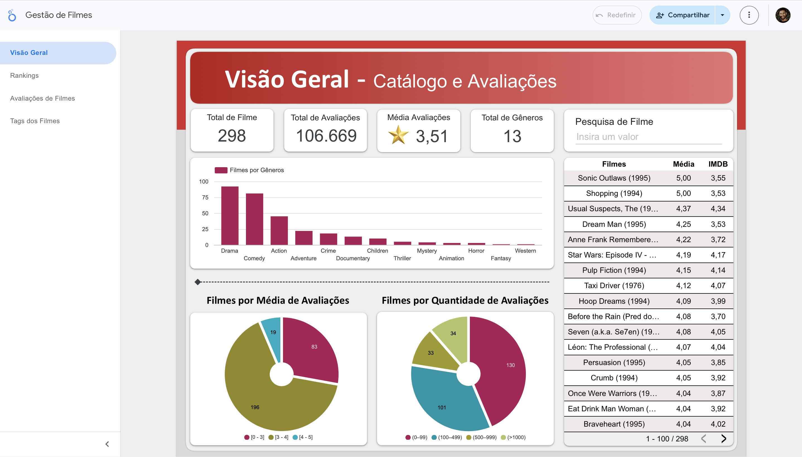
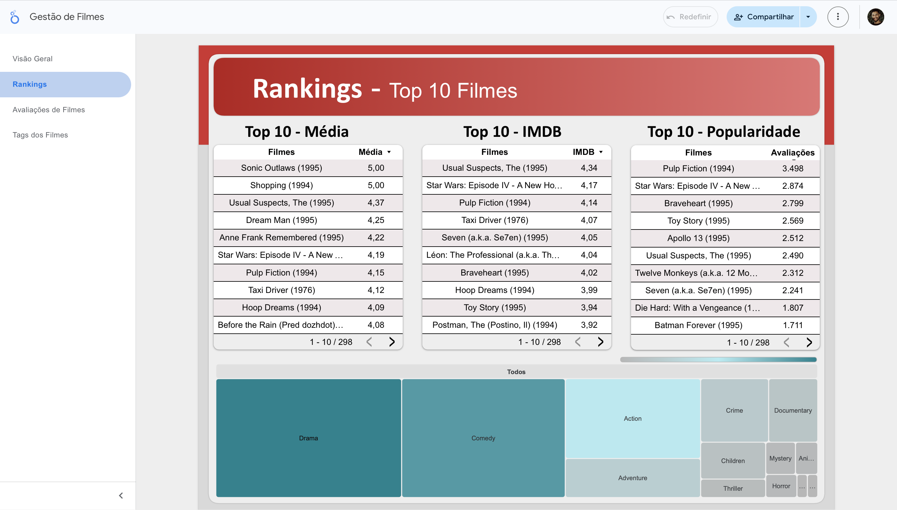
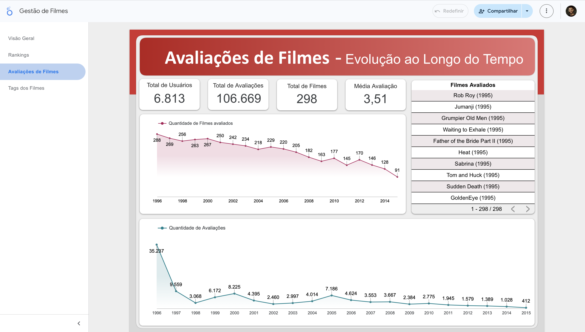
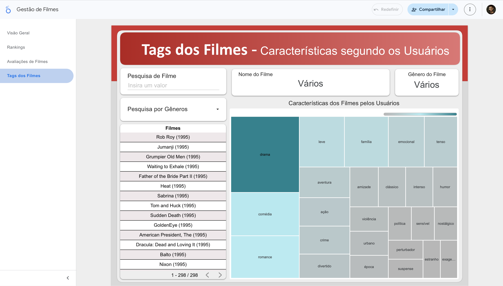

# Dashboard de Análise de Filmes

Projeto de **visualização e análise de dados de filmes** desenvolvido no Looker Studio utilizando dataset do Kaggle.

O objetivo é explorar avaliações de usuários, popularidade dos filmes, distribuição por gênero e padrões de percepção do público.

---

# Dashboard Interativo

Acesse o dashboard completo:

https://lookerstudio.google.com/reporting/cb7d4898-ce0d-4763-b4b7-49581d69378c

---

# Estrutura do Dashboard

O dashboard foi dividido em quatro páginas principais para facilitar a análise dos dados.

---

# Visão Geral

Apresenta indicadores principais do catálogo de filmes:

- Total de Filmes
- Total de Avaliações
- Média de Avaliações
- Total de Gêneros

Também permite pesquisar filmes e aplicar filtros.

---

# Rankings de Filmes

Apresenta os Top 10 filmes considerando diferentes critérios:

- Média de avaliação
- Nota estilo IMDb
- Popularidade (quantidade de avaliações)

Os rankings podem ser filtrados por gênero.

---

# Evolução das Avaliações

Mostra como o comportamento dos usuários mudou ao longo do tempo, apresentando:

- Quantidade de usuários ativos
- Evolução do número de avaliações
- Distribuição das avaliações por período.

---

# Tags e Características dos Filmes

Explora as **tags atribuídas pelos usuários**, permitindo identificar padrões de percepção do público sobre os filmes.

---

# Dataset Utilizado

O projeto utiliza dados estruturados em diferentes tabelas relacionadas ao domínio de filmes:

- movies
- ratings
- tags
- rating_c_global

Essas tabelas se relacionam principalmente pelo campo **movieId**, que funciona como chave de integração entre os dados.

---

# Tecnologias Utilizadas

- Looker Studio
- SQL
- Dataset Kaggle
- GitHub para documentação e versionamento

---

# Estrutura do Repositório

dashboard-filmes-looker

├── README.md

├── base_dados

├──── movie.xlsx

├──── movies_tags3.csv

├──── rating-2.xlsx

├── imagens

├──── Avaliacoes.png

├──── Rankings.png

├──── Tags.png

├──── Visao_Geral.png

├── relatorios

├──── Gestão_de_Filmes.pdf

├──── Rafael_Inacio_Silva_DR1_TP1.pdf

├──── Rafael_Inacio_Silva_DR1_TP2.pdf

---

# Autor

Rafael Inácio Silva  
Engenharia de Software  
Pós-graduação em Inteligência Artificial
